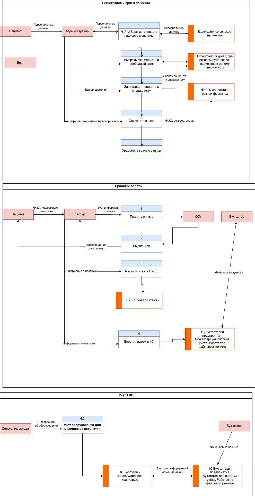
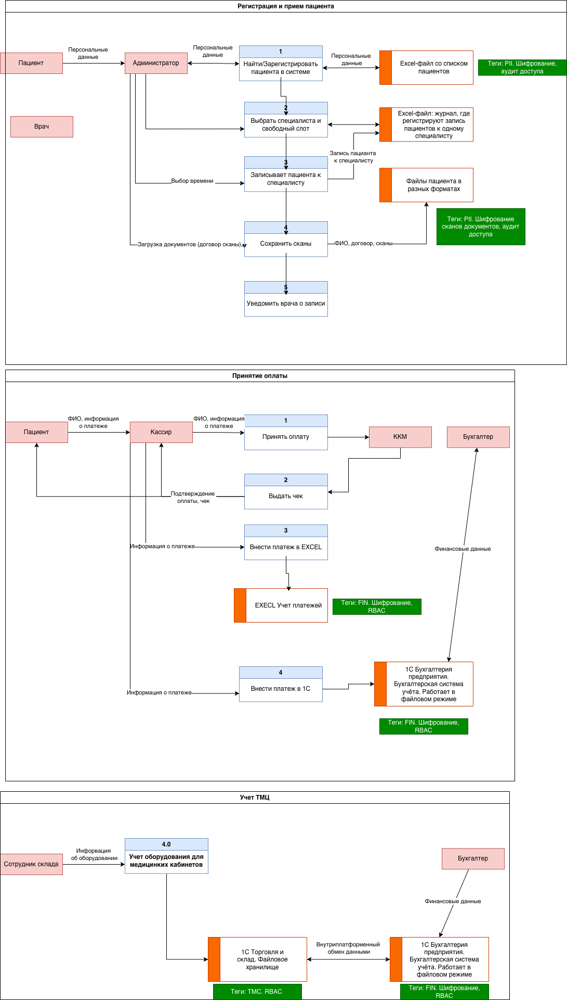

# Задание 1. Анализ безопасности системы
## 1. Выявите конфиденциальные данные, которые не Ручтены во внутренних системах.
1. Медицинские данные (хранятся в сканах/EXCEL):
    - хронические заболевания;
    - медицинские карты.

2. PII - Персональные данные (Всю эту информацию сотрудники обрабатывают вручную):
    - адрес прописки;
    - место работы/учебы.

3. Внутренние данные:
    - Active Directory;

### Диаграммы потоков данных

## 2. Проведите аудит мер по обеспечению безопасности данных.

### Аудит мер по обеспечению безопасности данных
#### Регистрация пациента в системе
| Аспект | Текущее состояние | Риски |
|-------------|-------------|-------------|
| Конфиденциальность   | PII хранится в Excel-файлах и сканах на общем диске. Доступ по доменной аутентификации без разграничений. Нет шифрования.    | Любой сотрудник может прочитать любые медицинские данные. Нет защиты от внутреннего инсайдера.    |
|Целостность | Нет версионирования, нет журнала изменений. Файлы Excel можно случайно или намеренно изменить.| Нет аудита по изменениям. Риск ошибок при ручном вводе|
|Доступность | Зависит от доступности файлового сервера. | При отказе диска и повреждения файла EXCEL данные будут потеряны|
| Шифрование| Все данные хранятся в открытом виде | Нарушение 152-ФЗ

#### Запись пациента к специалисту
| Аспект | Текущее состояние | Риски |
|-------------|-------------|-------------|
|Конфиденциальность| Журнал записей к приему врачу хранится в EXCEL| Утечка данных о том, кто к каким врачам ходит|
|Целостность| Можно задним числом изменить запись, удалить или добавить. Нет подтверждения от пациента.| Человеский фактор. Ошибки в записях|
|Доступность| При единовременном обращении нескольких сотрудников ресепшена к файлу Excel - блокировки и конфликты.| Сбой в часы пик приведет к невозможности записи пациентов.|

#### Процессниг платежей
| Аспект | Текущее состояние | Риски |
|-------------|-------------|-------------|
|Конфиденциальность| Дублирование данных в 1C и EXCEL | Excel на общем диске - прямая утечка финансовой информации. 1С в файловом режиме не шифрует данные на диске.|
|Целостность|Двойной ручной ввод (кассир вносит и в ККМ, и в 1С, и в Excel). Нет автоматической сверки.| Рассинхронизация данных - в разных системах разные суммы. Риск мошенничества |
| Доступность| Файловый режим 1С критичен: при повреждении файла базы данных (блокировки, сбой питания) бухгалтерия встанет.| Остановка бизнеса. Потеря данных за период.|
| 152-ФЗ в части финансовых данных| Финансовые данные относятся к ПДн. Защита отсутствует.| Не соответсвует 152-ФЗ
#### Учет ТМЦ

| Аспект | Текущее состояние | Риски |
|-------------|-------------|-------------|
|Конфиденциальность| Данные о закупках, ценах, поставщиках хранятся в 1С (файловый режим). | Доступ к коммерческой информации без контроля. Риск утечки данных поставщиков и цен конкурентам.|
|Целостность|ДРучной ввод поступления и списания. Расхождение с фактическими остатками.| Хищения ТМЦ могут быть незаметны в учете. Невозможность точно рассчитать себестоимость услуг. |
| Доступность| Файловый режим 1С (те же риски, что и в бухгалтерии).| Остановка склада - остановка закупок и обеспечения медкабинетов.|
| Аудит действий| 1С в файловом режиме не дает детального аудита.| Не соответсвует 152-ФЗ

## 3. Подумайте, что можно улучшить.
### Составьте список данных для защиты и проставьте для каждого способы защиты — шифрование, обфускация, обезличивание.
| Данные | Способ защиты |
|-------------|-------------|
|PII| Шифрование при хранении (AES-256), TLS при передаче, псевдонимизация для аналитики|
|Медицинские данные (чувствительные)| Шифрование (AES-256), строгий RBAC, аудит каждого доступа, обезличивание для исследований|
|Финансовые данные | Шифрование при хранении|
|Учетные данные| Хеширование |
|Данные о ТМЦ| Шифрование при хранении, RBAC (склад/бухгалтерия)|

### Разработайте механизм тегирования данных с использованием инструментов тегирования.

| Тег | Описание | Применяемые политики |
|-------------|-------------|-------------|
|PII| Персональные данные (ФИО, телефон, email)| Шифрование at rest, маскирование в интерфейсах, аудит доступа|
| MED | Медицинские данные (диагнозы, анализы)| Строгий RBAC (только лечащий врач и пациент), шифрование, обязательный аудит|
| FIN| Финансовые данные (суммы, платежи)| Шифрование, RBAC (бухгалтерия, касса), аудит|
|PUBLIC| Общедоступные данные (расписание, прайс)| Без ограничений|
|TMC|Данные о товарно-материальных ценностях| RBAC (склад, бухгалтерия)

#### Инструменты
- БД: колонки tags
- В файлах: метаданные (например S3)
- API: заголовки

### Составьте список инструментов, способов и мер, которые позволят обеспечить конфиденциальность данных в указанных потоках.
1. Шифрование:
    - Хранение: AES-256
    - Передача: TLS 1.3

2. Контроль доступа:
    - RBAC (роли), ABAC (на основе атрибутов).

### Доработайте диаграммы из предыдущего шага: отобразите на них, что следует использовать на каждом этапе потока.
