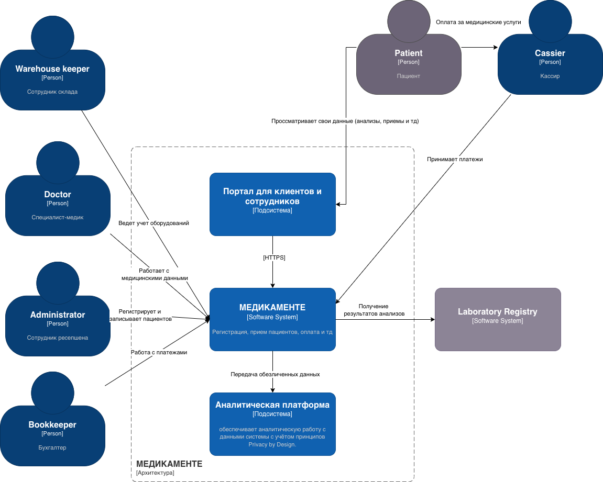

# Задание 2. Проектирование решения
## Архитектурные блоки системы МЕДИКАМЕНТЕ (см. скриншот)
- API Gateway
- Keycloak (Identity and Access Management)
- Classification Engine: для классификации данных
- Tagging Service: определение тегов
- Logging: система логирования
- Monitoring (SIEM, Prometheus/Grafana)
- Kafka 
- Слой аналитики данных - Аналитическая платформа (подсистема МЕДИКАМЕНТЕ)

