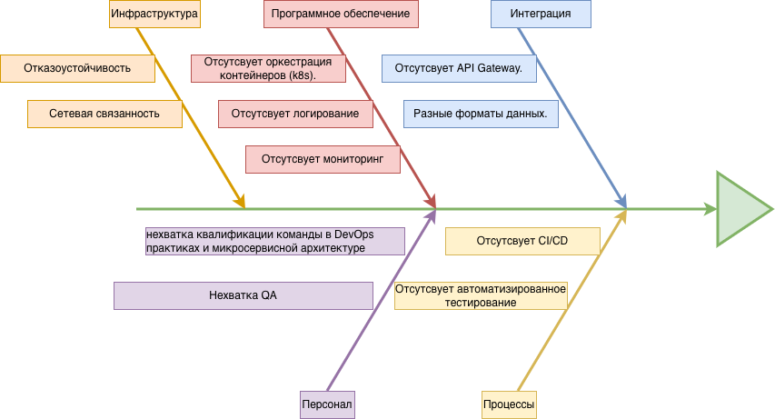

# Задание 4. Оценка узких мест при миграции

## Рекомендация и приоритеты

|Мера|Категория|Приоритет|
|-----|--------|---------|
|Подготовить оборудование для новой архитектуры| Инфраструктура | Высокий|
| Внедрить оркестрацию k8s | Программное обеспечение | Высокий |
| Внедрить центролизованное логирование (ELK), мониторинг (Prometheus, Grafana) | Программное обеспечени | Высокий |
| Обучение по DevOps практик и микросервисной архитектуре | Персонал | Средний |
| Внедрение API Gateway, Keycloack | Интеграция | Средний |
| Внедрить CI/CD | Процессы | Высокий|
