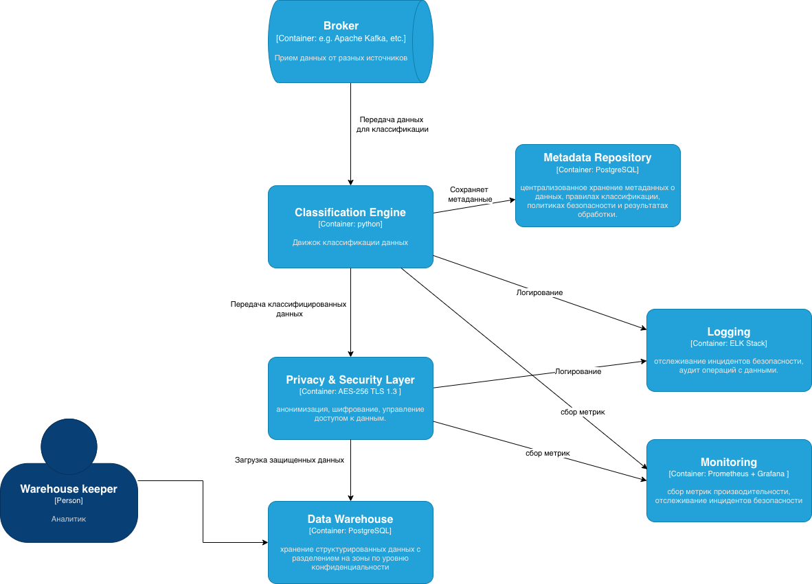

# Задание 6. Классификация данных

## Метрики эффективности классификации

- Точность классификации: долю правильно классифицированных данных от общего объёма.
- Полнота: способность системы обнаруживать все конфиденциальные данные.
- Время обработки: производительность движка классификации
- Ложные срабатывания: процент конфиденциальных данных, к которым *фактически применены* защитные меры (анонимизация, шифрование, контроль доступа), от всех данных, классифицированных как конфиденциальные.

## Масштабируемость (Scalability)
- Горизонтальное масштабирование:
  - контейнеризация компонентов (Docker + Kubernetes);
  - partition Kafka
- Автомасштабирование: динамическое выделение ресурсов под нагрузку.
- Кэширование: Redis  для часто используемых метаданных;